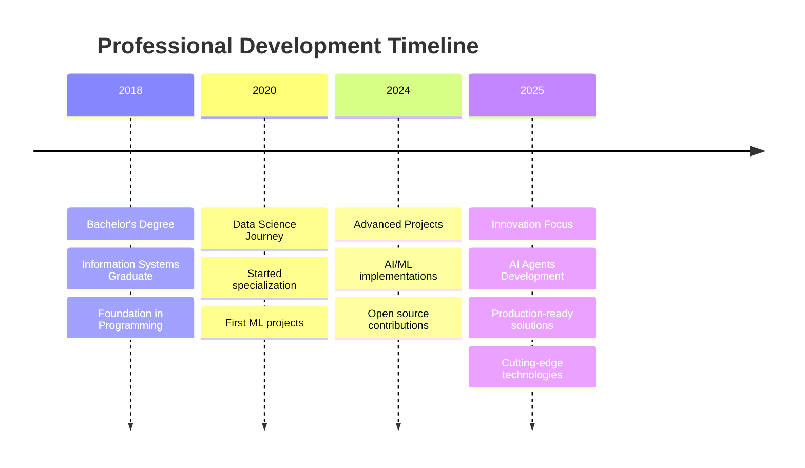

  

<h1 align="center">
  
</h1>

  
  
  
  

---

## 🚀 About Me

**AI Agent Developer & Data Scientist** with expertise in creating intelligent multi-agent systems and transforming data into actionable insights. Specialized in **CrewAI**, **OpenAI**, and **LangChain** for building production-ready AI solutions.

- 🎓 **Education**: Bachelor's in Information Systems (2018)
- 📊 **Specialization**: Data Science Training at [Data Science Academy](https://www.datascienceacademy.com.br/pages/home)
- 🤖 **AI Expertise**: CrewAI, OpenAI GPT-4, LangChain, AutoGen, RAG Systems
- 💡 **Interests**: AI Agents, Machine Learning, Data Analytics, Open Source
- 📚 **Always Learning**: Cutting-edge AI frameworks, Agent orchestration, LLM integration
- 🌱 **Currently Exploring**: Multi-agent systems, Advanced RAG, Vector databases, AI automation

---

## 🛠️ Tech Stack

### Languages

### AI Agents & LLM Frameworks

### Data Science & ML

### Vector Databases & RAG

### Tools & Platforms

---

## 🤖 AI Agent Development Expertise

### 🧠 Intelligent Agent Frameworks

<table>
<tr>
<td width="25%">

**🚀 CrewAI**
- Multi-agent systems
- Role-based collaboration
- Task orchestration
- Agent coordination

</td>
<td width="25%">

**🔮 OpenAI**
- GPT-4 integration
- Function calling
- Assistants API
- Custom fine-tuning

</td>
<td width="25%">

**⛓️ LangChain**
- LLM orchestration
- Chain composition
- Memory management
- Tool integration

</td>
<td width="25%">

**🤝 AutoGen**
- Conversational agents
- Multi-agent chat
- Code generation
- Collaborative AI

</td>
</tr>
</table>

### 🎯 Specialized AI Technologies

---

## 🏆 Featured Projects

### 🤖 AI & Machine Learning Projects

<table>
<tr>
<td width="50%">

**🎯 [Agente Concurseiro](https://github.com/clenio77/agente_concurseiro)**
> AI-powered study assistant for competitive exams
- **Tech Stack**: Python, OpenAI GPT-4, LangChain
- **Features**: Intelligent study planning, content analysis, RAG system
- **Status**: Active Development (2025)

**🏛️ [Licitação AI](https://github.com/clenio77/licitacao-ai)**
> AI system for public bidding analysis
- **Tech Stack**: Python, CrewAI, Vector Databases
- **Features**: Multi-agent analysis, compliance checking, document processing
- **Status**: Production Ready (2025)

**🎵 [AI Music Composer](https://github.com/clenio77/composer)**
> Intelligent Christian music composition agent
- **Tech Stack**: Python, AI, Music Generation
- **Features**: Automated composition, lyric generation
- **Status**: Collaborative Project (2025)

</td>
<td width="50%">

**📱 [Instagram Clone](https://github.com/clenio77/clone-insta)**
> Full-featured social media platform replica
- **Tech Stack**: Modern Web Technologies
- **Features**: Photo sharing, social interactions
- **Status**: Feature Complete (2025)

**⬇️ [Stream Downloader](https://github.com/clenio77/stream-downloader)**
> Automated video download and organization system
- **Tech Stack**: Python, Automation
- **Features**: Telegram integration, smart organization
- **Status**: Production Ready (2025)

**🔮 [Arcane Project](https://github.com/clenio77/arcane-project)**
> Cutting-edge development project
- **Tech Stack**: Advanced Technologies
- **Features**: Innovative solutions
- **Status**: In Development (2025)

</td>
</tr>
</table>

### 📈 Data Science & Analytics Portfolio

---

## 🎖️ Certifications & Achievements

### 🏅 GitHub Achievements

---

## 📊 GitHub Analytics

  
  

  

  

---

## 💼 Professional Journey

### 🎯 Current Focus Areas

<table>
<tr>
<td width="33%">

**🤖 AI Agents & LLM**
- **CrewAI** - Multi-agent orchestration
- **OpenAI GPT** - Language model integration
- **LangChain** - LLM application framework
- **AutoGen** - Conversational AI agents
- **RAG Systems** - Retrieval-augmented generation

</td>
<td width="33%">

**📊 Data Science**
- Statistical Analysis
- Predictive Modeling
- Data Visualization
- Big Data Processing

</td>
<td width="33%">

**💻 Software Development**
- Python Development
- Web Applications
- API Development
- Automation Solutions

</td>
</tr>
</table>

---

## 📈 Contribution Stats

### 🔥 Contribution Heatmap

### 📊 Detailed Analytics

<table>
<tr>
<td>

</td>
<td>

</td>
</tr>
</table>

---

## 🤝 Let's Connect & Collaborate

### 💬 Open to Opportunities
I'm always excited to discuss **Data Science**, **AI/ML Projects**, **Open Source Contributions**, and **Innovative Solutions**!

### 🌐 Professional Networks

### 📧 Collaboration Interests
- 🤖 **AI Agent Systems** - CrewAI, OpenAI, LangChain, Multi-agent orchestration
- 🧠 **LLM Applications** - RAG systems, Vector databases, Custom AI solutions
- 📊 **Data Science** - Analytics, Visualization, Predictive Modeling
- 🔧 **Open Source** - AI frameworks, Python libraries, Automation tools
- 💡 **Innovation** - Cutting-edge AI, Agent research, Production deployment

---

  

