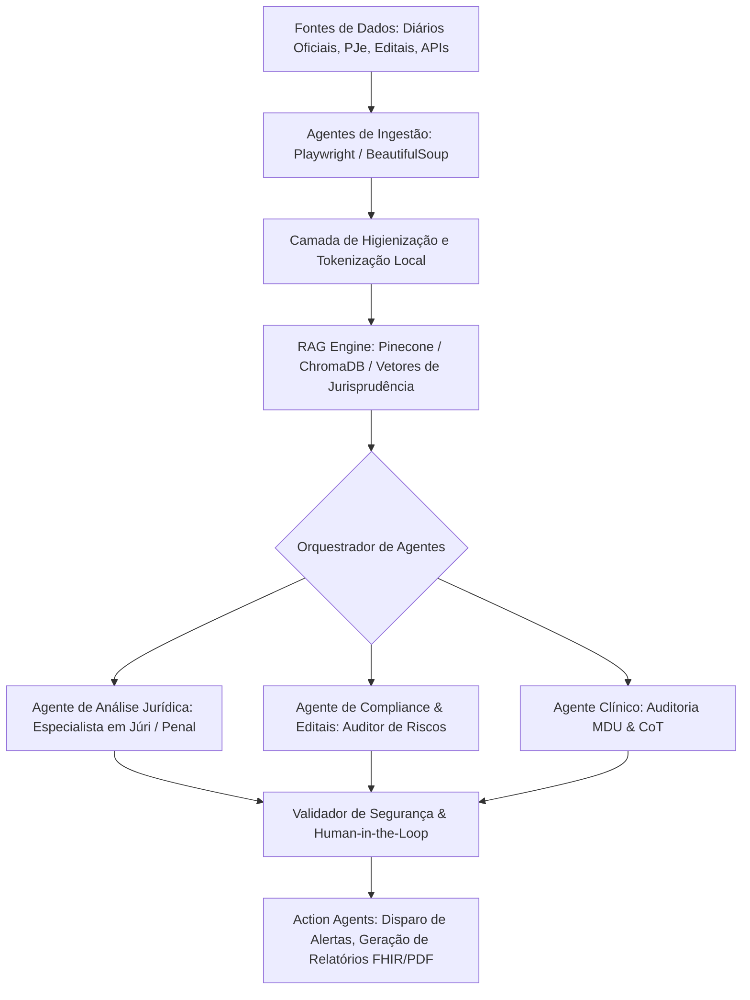
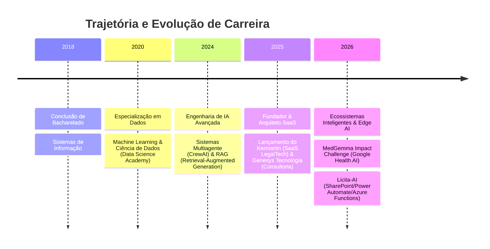

  

<h1 align="center">
  
</h1>

  
  
  
  

---

## 🚀 Perfil Profissional

**AI Agent Engineer | Arquiteto de Sistemas SaaS | Cientista de Dados**

Especializado no desenvolvimento de ecossistemas inteligentes corporativos e soluções completas ponta a ponta (SaaS). Atuo com foco em modelagem preditiva, engenharia de prompts avançada (Chain-of-Thought) e orquestração de sistemas multiagente autônomos para setores regulados de alta complexidade, como **LegalTech**, **GovTech** e **HealthTech**.

- 🔭 **Fundador**: [Kermartin](https://kermartin.onrender.com) (SaaS de Jurimetria Preditiva & Defesa Criminal) e [Genesys Tecnologia](https://genesys.ia.br) (Consultoria em IA & Compliance).
- 🎓 **Formação**: Bacharel em Sistemas de Informação (2018).
- 🤖 **Especialidades em IA**: Orquestração Multiagente (CrewAI), RAG Avançado, Modelagem Preditiva e Edge AI para processamento local de dados clínicos.
- 🛡️ **Segurança e Conformidade**: Pipelines locais de anonimização sob conformidade com a LGPD e auditoria de APIs.

---

## 🤖 Arquitetura de Agentes Inteligentes

Especialista no design de sistemas de agentes autônomos distribuídos que cooperam para resolver fluxos de trabalho empresariais complexos:

### 🧠 Abordagem Técnica de IA
* **Agentes de Ingestão**: Web scrapers assíncronos e pipelines robustos estruturados para extração de dados públicos respeitando limites de requisições.
* **Agentes Analistas (Cognição)**: Integração com LLMs avançados operando sob lógica estruturada de prompts, controle estrito de contexto e orquestração modular.
* **Agentes Executores (Ação)**: Geração de entregáveis estruturados (FHIR JSON, relatórios PDF detalhados) e alertas automatizados em canais de comunicação.

---

## 🏆 Projetos em Destaque

  <h3>🚀 SaaS & Soluções Comerciais</h3>

<table>
<tr>
<td width="50%">

**⚖️ [Kermartin IA](https://kermartin.onrender.com)**
> **SaaS de Jurimetria Preditiva & Análise Processual**
- **Escopo**: Análise automatizada de processos de rito especial do Júri e decote de qualificadoras (Art. 121, CP).
- **Stack**: Django, React (Vite), Celery, Redis, PostgreSQL, CrewAI (orquestração via prompts em YAML).
- **Diferencial**: Adapters dogmáticos modulares, pipeline local de anonimização LGPD e processamento assíncrono distribuído.
- **Status**: 🟢 Produção (Ativo)

</td>
<td width="50%">

**🏛️ [Licita-AI](https://github.com/clenio77/licita-ai)**
> **GovTech para Compliance de Editais Públicos**
- **Escopo**: Automação do fluxo de requisições e análise inteligente de risco em contratações governamentais.
- **Stack**: Microsoft 365, SharePoint Lists, Power Automate, Azure Functions (Node.js/Graph API), OpenAI API.
- **Diferencial**: Dashboard analítico em Power BI com Row-Level Security e controle completo de auditoria baseado em roles.
- **Status**: 🟢 Produção (Implementado)

</td>
</tr>
</table>

  <h3>🧪 Pesquisa, IA Local & Open Source</h3>

<table>
<tr>
<td width="50%">

**🛡️ [MedGemma Guardian](https://github.com/clenio77/MedGemma)**
> **Agente de Auditoria Clínica e Segurança do Paciente**
- **Escopo**: Auditoria automatizada de prescrições médicas para mitigação de hepatotoxicidade (Google Health Impact).
- **Stack**: MedGemma (2b quantizado 4-bit), Python, Chain-of-Thought (CoT), FHIR JSON.
- **Diferencial**: Processamento local em Edge AI (rodando com 4GB VRAM) garantindo privacidade offline absoluta dos pacientes.

</td>
<td width="50%">

**🔒 [Genesys Security Auditor](https://github.com/clenio77/genesys-seguranca-auditoria)**
> **API de Auditoria de Segurança Web & LGPD**
- **Escopo**: Varredura passiva de conformidade de infraestrutura pública e vulnerabilidades de rede.
- **Stack**: FastAPI, BeautifulSoup, SSL Module.
- **Diferencial**: Motor assíncrono focado em análise rápida de cabeçalhos HTTP e validade criptográfica de certificados SSL/TLS.

</td>
</tr>
<tr>
<td width="50%">

**🎵 [SonicStream](https://github.com/clenio77/video-extractor)**
> **Extrator de Áudio & Vídeo com Interface PWA**
- **Escopo**: Conversão assíncrona e download de mídias de plataformas de vídeo.
- **Stack**: FastAPI, yt-dlp, Docker, PWA (Frontend responsivo).
- **Diferencial**: Empacotamento Docker otimizado para deploy simplificado em servidores VPS (DigitalOcean).

</td>
<td width="50%">

**🎯 [Agente Concurseiro](https://github.com/clenio77/agente_concurseiro)**
> **Tutor Inteligente de Estudos com RAG**
- **Escopo**: Assistente de estudos baseado nos editais de exames públicos e materiais de referência.
- **Stack**: LangChain, OpenAI API, Vector Databases.
- **Diferencial**: Geração aumentada de recuperação estruturada para fornecer respostas precisas e referenciadas em leis.

</td>
</tr>
</table>

---

## 🛠️ Stack Tecnológica

### Engenharia de IA & Orquestração

### Backend & Engenharia de Dados

### Automação & Crawlers

### Bancos Vetoriais & Cloud Infrastructure

---

## 💼 Linha do Tempo Profissional

---

## 📊 Estatísticas do GitHub

  
  

  

