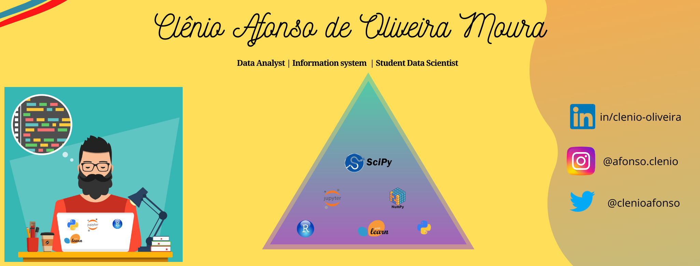
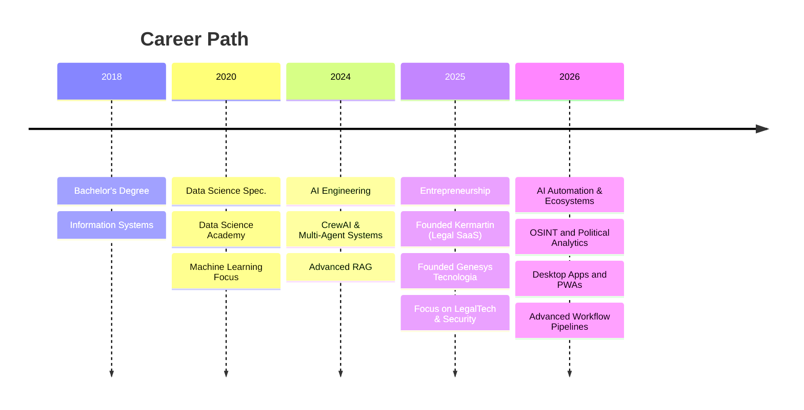

  

<h1 align="center">
  
</h1>

  
  
  
  
  

---

## 🚀 About Me

**SaaS Founder | AI Agent Engineer | Data Scientist**

I am a passionate developer based in **Uberlândia, Brazil**, bridging the gap between Data Science and Software Engineering. Currently, I am building intelligent ecosystems for the **LegalTech** industry, transforming complex legal data into actionable insights through Autonomous Agents.

- 🔭 **Founder of**: [Kermartin](https://kermartin.onrender.com) (Jurimetrics SaaS) & [Genesys Tecnologia](https://genesys.ia.br) (AI Consultancy).
- 🎓 **Education**: Bachelor's in Information Systems (2018).
- 🤖 **AI Expertise**: Multi-Agent Systems (CrewAI), RAG, Predictive Modeling & LLM Engineering.
- 🛡️ **Security**: Web Security Auditing & LGPD Compliance Automation.
- 🌱 **Currently Exploring**: Advanced Agentic Patterns, Vector Databases & Scalable API Architectures.

---

## 🛠️ Tech Stack

### Core & Backend

### AI Agents & Orchestration

### Automation & Scraping

### Vector DBs & Deploy

---

## 🏆 Featured Projects

<h3>🚀 SaaS & Commercial Products</h3>

<table>
<tr>
<td width="50%">

**⚖️ [Kermartin IA](https://kermartin.onrender.com)**
> **SaaS de Jurimetria Preditiva & Análise Legal**
- **Tech Stack**: Python, CrewAI, Scikit-Learn, Render
- **Features**: Predição de Sentenças, Análise de Peças, Chat com Jurisprudência
- **Status**: 🟢 Production (Active)

</td>
<td width="50%">

**🛡️ [Genesys Security Auditor](https://genesys.ia.br)**
> **API de Auditoria de Segurança & LGPD**
- **Tech Stack**: FastAPI, BeautifulSoup, SSL Module
- **Features**: Validação SSL, Headers de Segurança, Score de Risco
- **Status**: 🟢 Production (Service)

</td>
</tr>
</table>

<h3>🧪 Research & Open Source</h3>

<table>
<tr>
<td width="50%">

**🎯 [Agente Concurseiro](https://github.com/clenio77/agente_concurseiro)**
> AI-powered study assistant for exams
- **Focus**: Education & RAG
- **Stack**: LangChain, OpenAI

</td>
<td width="50%">

**🏛️ [Licitação AI](https://github.com/clenio77/licitacao-ai)**
> Multi-agent system for public bidding
- **Focus**: GovTech & Compliance
- **Stack**: CrewAI, Vector DBs

</td>
</tr>
<tr>
<td width="50%">

**📡 [Radar IA](https://github.com/clenio77/radar_ai)**
> Automated multi-agent system for AI news monitoring
- **Focus**: OSINT & Automation
- **Stack**: Python, OpenAI, Firecrawl

</td>
<td width="50%">

**🎵 [SonicStream](https://github.com/clenio77/video-extractor)**
> Modern web app for audio/video extraction
- **Focus**: Media Processing & PWA
- **Stack**: FastAPI, yt-dlp, Docker

</td>
</tr>
<tr>
<td width="50%">

**📱 [KoTauri (Kotatogram)](https://github.com/clenio77/clenio-katotagram)**
> Telegram Web K Desktop & PWA wrapper
- **Focus**: Desktop Apps & PWA
- **Stack**: Tauri, React

</td>
<td width="50%">

**🤖 [AI Content Workflow](https://github.com/clenio77/auto-postagem)**
> Automated content production pipeline
- **Focus**: Media Automation
- **Stack**: LLMs, FFmpeg, Voice Cloning

</td>
</tr>
</table>

---

## 🤖 AI Agent Architecture

I specialize in building complex multi-agent systems where autonomous agents collaborate to solve real-world problems.

[Image of AI Agent Architecture Diagram]

### 🧠 My Approach to AI Engineering

<table>
<tr>
<td width="33%">

**🕵️‍♂️ The Scraper Agents**
Autonomous crawlers that monitor official diaries and legal courts (Playwright/BS4) to feed the system with real-time data.

</td>
<td width="33%">

**🧠 The Analyst Agents**
LLMs (GPT-4) configured with specialized roles (e.g., "Criminal Lawyer", "Compliance Officer") to process data.

</td>
<td width="33%">

**⚙️ The Action Agents**
Systems that execute final tasks: Draft documents, Alert via WhatsApp, or Generate PDF Reports.

</td>
</tr>
</table>

---

## 📊 GitHub Analytics

  
  

  

---

## 💼 Professional Timeline

